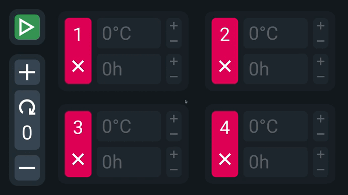

# Temperature Menagment GUI

full KMS - działa rozmiar okna, musi być podłączony monitor, nie wypierdala błędu libGLES
no OpenGL - działa rozmiar okna, nie musi być monitora, wypierdala błąd libGLES
fake KMS - pizda
przesył danych do rpi:
rsync -zaP ~/Desktop/TemperatureMenagmentGUI/TemperatureMenagmentGUI pi@192.168.148.219:~/Desktop/
